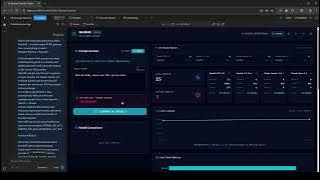

# SentinAI Gateway – AI Infrastructure & Dashboard

SentinAI Gateway is a full-stack AI management platform designed to centralize interactions with multiple Large Language Model (LLM) providers through a unified interface. Built during a fast-paced buildathon, the project combines modern frontend development, backend API design, and AI integration to provide a centralized dashboard for managing and monitoring AI services.

---

## Overview

As the AI ecosystem continues to expand, organizations often interact with multiple model providers for different tasks. SentinAI Gateway was developed to explore how a centralized gateway could simplify model access, routing, monitoring, and management through a single platform.

The system combines a React-based frontend dashboard with a Node.js backend capable of communicating with multiple AI providers, enabling users to manage AI interactions through a unified experience.

---

## Key Features

- Unified AI gateway architecture
- Multi-provider LLM integration
- Responsive dashboard interface
- API usage monitoring and visualization
- State-driven frontend design
- REST API communication layer
- Modular full-stack architecture

---

## Technologies Used

### Languages

- TypeScript
- JavaScript
- HTML
- CSS

### Frontend

- React.js
- Vite

### Backend

- Node.js
- Express.js

### AI & APIs

- OpenAI API
- Anthropic API
- Google AI APIs

### Concepts

- Full-Stack Development
- API Integration
- AI Infrastructure
- State Management
- RESTful Services

---

## System Architecture

```text
User
 │
 ▼
React Dashboard
 │
 ▼
Express API Layer
 │
 ├── OpenAI
 ├── Anthropic
 └── Google AI
```

The frontend dashboard communicates with a centralized API layer which manages requests to multiple AI providers. This architecture creates a single entry point for AI interactions while maintaining flexibility for future integrations.

---

## Engineering Contributions

- Co-developed a full-stack AI gateway and management dashboard during a compressed buildathon timeline
- Integrated multiple LLM providers through a unified backend architecture
- Designed responsive frontend interfaces using React component architecture
- Implemented REST-based communication between frontend and backend services
- Utilized modern AI development workflows to rapidly learn unfamiliar technologies and deliver functional software under strict time constraints

---

## Challenges & Lessons Learned

One of the biggest challenges was working within a highly compressed development timeline while simultaneously learning and applying new technologies.

The project required quickly understanding modern frontend frameworks, API integration patterns, and AI development workflows while maintaining progress toward a working product.

Key takeaways included:

- Rapid prototyping techniques
- Modern React development workflows
- API-driven architecture
- Multi-service integration
- Team collaboration under tight deadlines
- Practical AI application development

---

## Demo Video

[](https://youtu.be/mAeBLBr5VG4)

---

## Future Improvements

- Authentication and user management
- Provider failover and fallback routing
- Request caching and optimization
- Analytics and reporting dashboards
- Cost tracking across providers
- Additional model integrations
- Deployment and scaling infrastructure

---

## Installation

### Clone Repository

```bash
git clone https://github.com/bilalakhlaque/AI-Gateway-Sentinel.git
cd AI-Gateway-Sentinel
```

### Install Dependencies

```bash
npm install
```

### Run Development Server

```bash
npm run dev
```

---

## Author

Bilal Akhlaque, Arhum Khan

- GitHub: https://github.com/bilalakhlaque
- LinkedIn: https://linkedin.com/in/bilalaakhlaque
